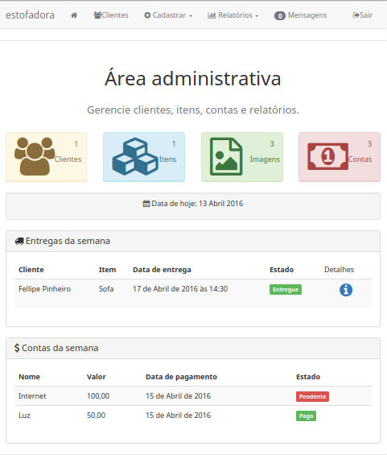
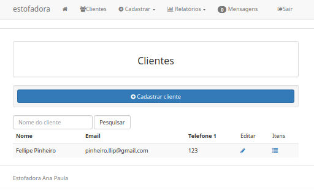
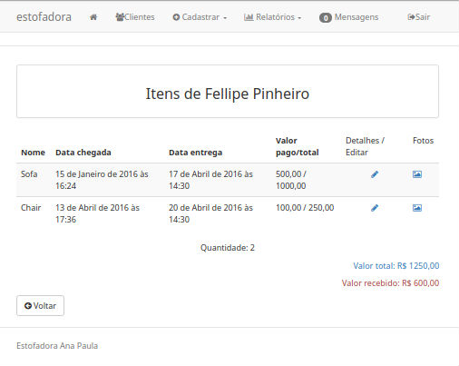
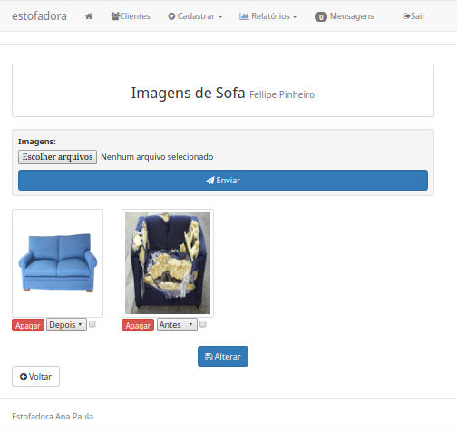
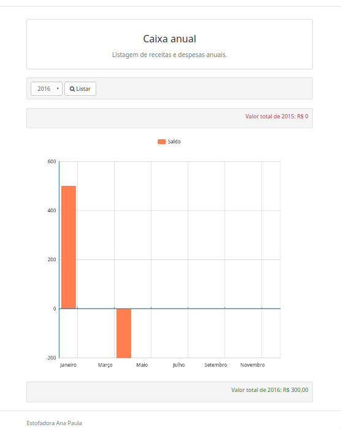

# Estofadora Manager

[](https://travis-ci.org/delete/estofadora)

> Manage bills, income, expenses and clients.


This project was made for my grandfather's business (who does not have so much contact with tech), who is an upholsterer. 
So I tried to keep as simple as possible.

Feel free to contribute and if you have any quention, open an issue and we'll talk about it.

> As the product was made for an brazilian, the whole system is in portuguese (but the code is in english).

## Python version

* Python 3.5

## Installation

* Install pip -> https://pip.pypa.io/en/latest/installing.html
* Install virtualenv -> https://virtualenv.pypa.io/en/latest/installation.html
* Create a folder with virtualenv:
```sh
$ virtualenv folder
```
* Activate the virtual enviroment:
```sh
$ cd folder
$ source bin/activate
```
* Clone this repository for the folder.

* Install the dependencies: 
```sh
pip install -r requirements.txt
```

## Usage example

* Create an .env file on settings directory with SECRET_KEY:
```sh
SECRET_KEY=MY_SUPER_SECRET_KEY
```

* Create and configure the database:
```sh
$ python manage.py makemigrations
$ python manage.py migrate
```

* Create an admin user:
```sh
$ python manage.py createsuperuser
```

* Runs the server:
```sh
$ python manage.py runserver
```

* Access the site: `http://127.0.0.1:8000/`
* Access the admin page: `http://127.0.0.1:8000/login`

## Production setup

* You can setup the whole production server with this script: [django_server_setup](https://github.com/delete/django_server_setup)

### .env file example

Create an `.env` file on `settings` directory with these variables:
```sh
SECRET_KEY=ARANDOMSECRETKEY
#OPBEAT
ORGANIZATION_ID=JUSTIFYOUAREUSING
APP_ID=JUSTIFYOUAREUSING
SECRET_TOKEN=JUSTIFYOUAREUSING
#DATABASE
NAME=DATABASENAME
USER=DATABASEUSER
PASSWORD=DATABASEPASS
HOST=DATABASEHOST
PORT=DATABASEPORT
ALLOWED_HOSTS=
```
## Development setup

The project is covered by unit tests, you can run them by doing:

```sh
$ python manage.py test
```

## ScreenShots

#### Dashboard Page


#### Clients Page


#### Items Page


#### Images from an item

You can add some photos of the item to show how it was before and after the work, for example.
If the image was marked (the checkbox), it will appear on the portfolio page on the website, automatically.



#### Financial reports: daily, monthly and annually


## Meta

Fellipe Pinheiro – [@pinheirofellipe](https://twitter.com/pinheirofellipe) – pinheiro.llip[at]gmail[dot]com

Distributed under the MIT license. See [``LICENSE``](https://opensource.org/licenses/MIT) for more information.

[https://github.com/delete/estofadora](https://github.com/delete/estofadora)
